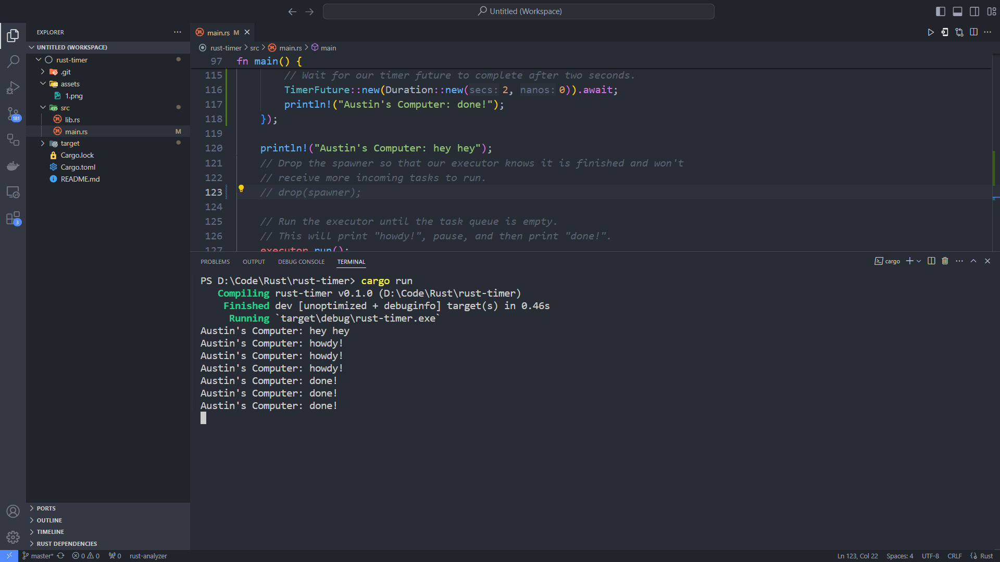

# Reflection

## 1.2. Understanding how it works.

The println command outside of the spawner which prints "hey hey" got printed first. This happens because the commands inside the spawner is executed after with the executor.run() command.

## 1.3. Multiple Spawn and removing drop

The multiple spawn command makes the executor execute all of the spawned threads. Which means that the program is executed multiple times according to how much me multiply the spawn code. The removed drop command doesn't actually show any difference explicitly. But because of this, the spawner is not closed and we can still spawn afterwards.
