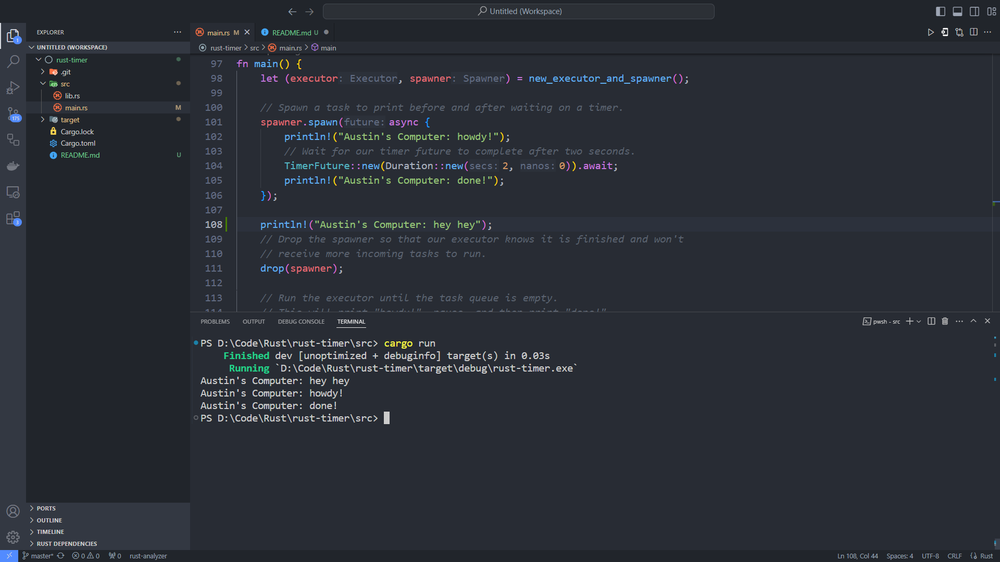

# Reflection

The println command outside of the spawner which prints "hey hey" got printed first. This happens because the commands inside the spawner is executed after with the executor.run() command.
